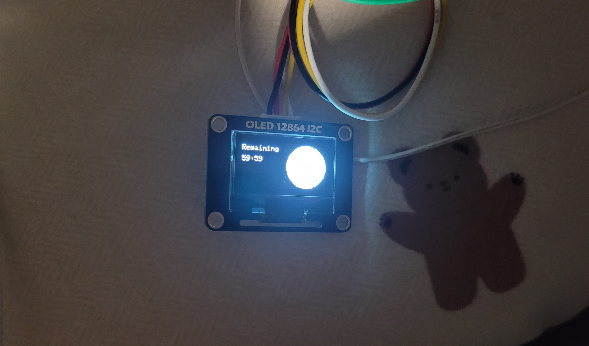
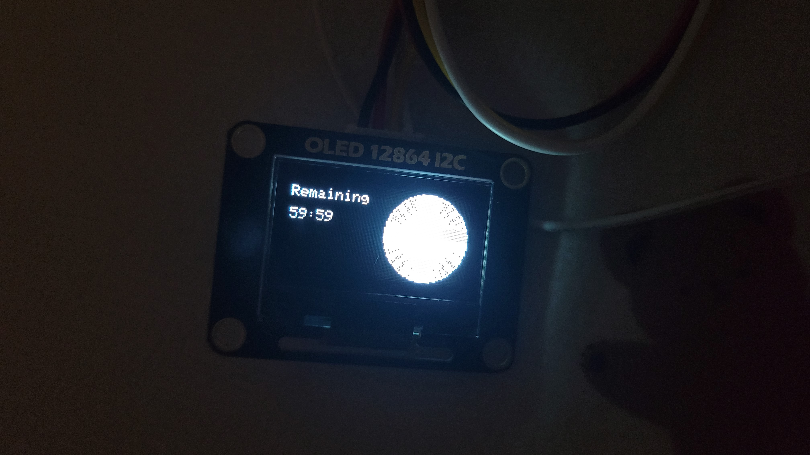
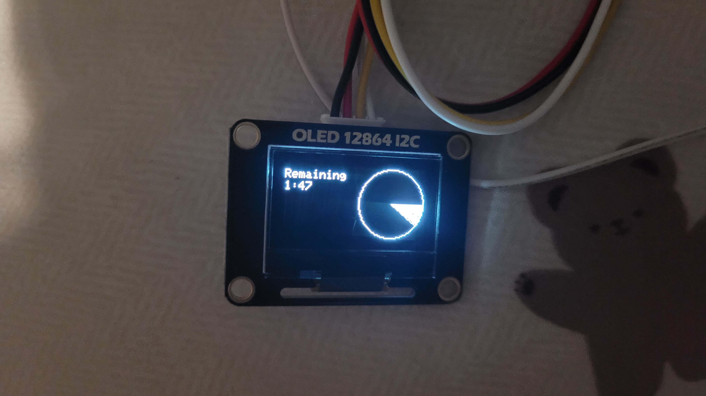
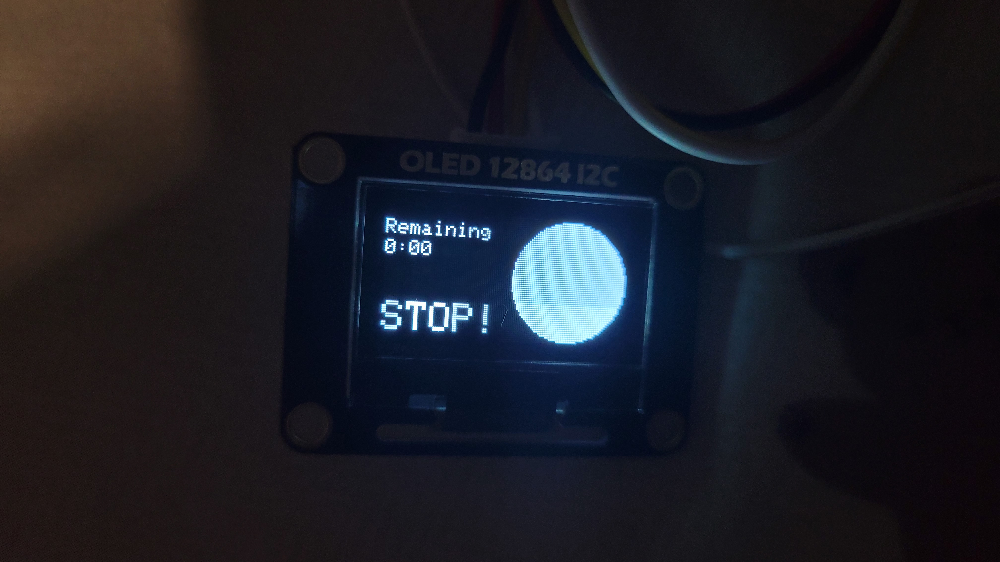

# 로그

## 개발 동기

https://www.youtube.com/watch?v=e-YH6DuxrKo

해당 유튜브 영상을 보다가 **구글 타이머**라는 존재를 알게 되었다. 생각보다 쓸만해보여서 한번 사볼까? 해서 찾아봤는데 거의 모든 제품이 만원이상이었다. 돈은 없었지만 기다리기는 싫었는데, 마침 가방에 NodeMCU 모듈과 점퍼 케이블 딱 4개, OLED 모듈이 있었다. 오! 이거면 만들 수 있겠다! 라고 생각해서 시작하게 되었다.


## 개발 과정 

1. **개발 환경 구축**

언제나 설레는 개발 환경 구축. Arduino IDE 2.0 환경에서 NodeMCU 개발하기 위해 ESP8266 보드 매니저 설치 및 포트 설정을 하였습니다. 아래 블로그를 참조하였습니다.

https://postpop.tistory.com/14

++중간에 리눅스다운 권한 오류가 떠서 관련 USB 포트 권한을 풀었습니다.

```sh
sudo chmod 666 /dev/ttyUSB
```

2. **예제 코드 분석**

https://randomnerdtutorials.com/esp8266-0-96-inch-oled-display-with-arduino-ide/

헤당 페이지에서 OLED 작동 코드 및 기본 예제를 파악했습니다. 아두이노에 진심인 분들이 상당히 많으셔서 OLED 라이브러리가 상당히 잘 추상화되어 있었던게 인상 깊었었습니다.

3. **야금야금 코드 작성**

진짜 간단한 토이 프로젝트였어서 별다른 설계 없이 바로 진행했었습니다.

우선 라이브러리를 포함해준다.

```c++
// Import--------------------
#include <Wire.h>
#include <Adafruit_GFX.h>
#include <Adafruit_SSD1306.h>
//----------------------------
```

그다음 디스플레이 크기를 설정해준다.

```c++
// Initialize the OLED display
#define SCREEN_WIDTH  128
#define SCREEN_HEIGHT 64
```

그 뒤 Adafruit_SSD1306 인스턴스를 하나 생성해준다.

```c++
// Initialize a display object 
Adafruit_SSD1306 display(SCREEN_WIDTH, SCREEN_HEIGHT, &Wire, -1);   // Wire : I2C Communication | -1 : Doesn't have RESET button on OLED Display
```

다음으로 `setup()` 함수를 설정해준다. 먼저 디버깅용인 Serial을 시작해준 뒤, `display` 객체를 생성해준다.

```c++
Serial.begin(115200);

// Initialize the OLED Display with begin()
if(!display.begin(SSD1306_SWITCHCAPVCC, 0x3C))    // SSD1306_SWITCHCAPVCC -> 0x02 : 3.3 | 0x01 : External display voltage source : SSD1306_EXTERNALVCC
{
Serial.println("SSD1306 allocation failed");
}
delay(2000);
```

그 뒤 가볍게 디스플레이를 지워주고, 디스플레이를 설정해준다.

```c++
// Clear Display
display.clearDisplay();

// Configuration Display
display.setTextSize(1);                   // font size
display.setTextColor(WHITE);              // font color
```

내가 만드려는 건 타이머였기에, 지속적인 디스플레이 클리어 및 시간을 업데이트 해줘야 한다. 그렇기에 함수를 하나 만들어 loop를 돌려주는 형식으로 동작시키는 방식으로 만들었다.

```c++ 
// setup() 밖에서 함수를 하나 만든다.

void timer_display(int limit) {
  display.clearDisplay();

  display.setCursor(0,5);                  // Cursor set
  display.println("Remaining");
  display.setCursor(0, 20);
  display.println("59:59");
  display.fillCircle(96, 32, 30, WHITE);    // (x, y, radius, color)
  display.drawPixel(96, 32, BLACK);

  display.display();
}
```

디버깅용으로 디스플레이를 한번 표시해준다. 그렇게 코드를 작성하고 나면



나름 잘 나온 것을 확인 할 수 있었다!

4. **시계 기능 만들기**

이제 이 프로젝트의 핵심 기능 시간 카운팅 기능을 만들어줘야 한다. 기존 타이머와는 다르게 구글 타이머는 시간이 얼마나 남았는지 직관적으로 보여주는 기능이 있기 때문에 저 시계의 흰색 부분을 야금야금 잡아먹는 코드가 필요하다.

이를 해결하려면 수학 지식이 필요했는데, 처음에는 원의 방정식에서 `x`, `y`를 구하는 방식으로 접근했었다.

$$(x-96)^2+(y-30)^2=30^2$$

a, b, r의 크기가 고정되어 있었기에 이를 역이용해서 x, y의 해를 구하는 방식으로 갔었다. 그러나 미지수가 2개인 이차방정식의 해를 구하는 건 상당히 어려웠고, 정수만 해도 경우의 수가 참 많은데 실수 범위로 넘어가려 하니 상당히 머리가 깨지려 했었다. 그래서 노가다짓 말고 다른 방법을 찾았다.

**삼각함수**, 이 프로젝트의 해결 방책이었다. `sin`, `cos`를 통해 원을 만들어낼 수 있어 이를 이용해 원 둘레에 존재하는 모든 점의 값을 구할 수 있었다. 

공식은 다음과 같다. 

$$x=r*cos\theta+96, y=r*sin\theta+30$$

해당 공식을 도입하기 전, python 코드로 미리 테스트 해보았다.

```python
import math

x = 96; y = 32; r = 30;

px = r * math.cos(math.pi * (180 / 180))
py = r * math.sin(math.pi * (180 / 180))

print(int(px) + x, int(py) + y)
```

OLED는 실수값을 표현하지 못하니 정수값만을 도출하여 다소 빈약한 부분이 있었지만 나름 만족스런 값을 얻을 수 있었다!

이에 바로 C++ 버전으로 바꾼 타이머 계산 코드를 작성했다.

```c++
for(i = 0; i<limit; i++) {
    display.drawLine(TIMER_X, TIMER_Y, int(TIMER_R * cos(PI * double(i/180))) + TIMER_X, int(TIMER_R * sin(PI * double(i/180))) + TIMER_Y, WHITE);
  }
```

`TIMER_`로 된 define은 그냥 x,y 좌표와 radius를 표현한 것이다.

해서 다음과 같은 코드로 동작시키니 다음과 같은 화면을 출력받을 수 있었다!



... 좀 아쉬운 점도 있었지만, 뭐 어쩐다. 정수로만 표현을 하다보니 한계가 드러날 수 밖에 없었다.

5. **Timer 만들기**

이제 그냥 Timer를 만들어보자. Delay를 주면서 시간을 체크해도 괜찮지만, 좀 더 정확한 표현을 위해 `millis()`를 사용했다.

```C++
// Initailize timer
#define TIMER_SET 3600000
int current_time;       // Current time
int clock_time;         // check 1 sec
int start_time;         // check timer start Time
int minute = 2; 
int second = 0;
```

millis 값을 받아줄 3개의 변수와 시간을 표시해줄 수 있는 변수를 선언했다. 

새롭게 만든 `timer_run()` 함수를 통해 1초마다 타이머 디스플레이가 작동하도록 하고, 시간을 출력하는 코드도 따로 함수화 시켰다.

```C++
void timer_run() {
  int count = 1;
  start_time = millis();
  clock_time = millis();
  while(current_time - start_time < TIMER_SET) {
    current_time = millis();
    if(current_time - clock_time >= 1000) {
      clock_time = millis();
      if((current_time - start_time) > TIMER_SET/360 *count) count = (current_time - start_time) / (TIMER_SET/360);     // **
      timer_display(count-1);
    }
  }
}
```

주석으로 표시한 부분은 원형 타이머 각을 정하는 코드이다. 일정 분기점을 지나면 표시해야 할 각을 증가하게 해두었다. 이 코드를 사용하면 60분 외의 시간도 설정해줄 수 있을 것이다. 분기가 지날수록 count를 1씩 증가시키는 코드도 짰었지만, 그렇게하면 60분 고정 타이머가 되어버린다.

```C++
void timer_time_display() 
{
  if(second == 0) {
    minute--;
    second = 59;
  }
  else second--;

  display.print(String(minute));
  display.print(":");
  if(second<10) display.print("0");
  display.println(String(second));
}
```

그리고 시간이 다 지났을 시 **STOP!**을 출력하는 코드를 `time_display()`에 구현하였다.

```c++
void timer_display(int limit) {
  double i = 0;

  display.clearDisplay();

  display.setCursor(0,5);                  // Cursor set
  display.println("Remaining");
  display.setCursor(0,15);  
  timer_time_display();
  display.drawCircle(TIMER_X, TIMER_Y, TIMER_R, WHITE);    // (x, y, radius, color)
  display.drawPixel(TIMER_X, TIMER_Y, WHITE);

  if(minute == 0 && second == 0) {
    display.fillCircle(TIMER_X, TIMER_Y, TIMER_R, WHITE);
    display.setTextSize(2);
    display.setCursor(0,30);
    display.println("STOP!");
  }
  else {
    for(i = 0; i<limit; i++) {
      display.drawLine(TIMER_X, TIMER_Y, int(TIMER_R * cos(PI * double(i/180))) + TIMER_X, int(TIMER_R * sin(PI * double(i/180))) + TIMER_Y, WHITE);
    }
  }

  display.display();
}
```

6. **1분기 기능 구현 완료 - 전체 코드**

```c++
// Import--------------------
#include <Wire.h>
#include <Adafruit_GFX.h>
#include <Adafruit_SSD1306.h>
//----------------------------

// Initialize the OLED display
#define SCREEN_WIDTH  128
#define SCREEN_HEIGHT 64

// Initialize Timer display
#define TIMER_X 96
#define TIMER_Y 32
#define TIMER_R 30

// Initailize timer
#define TIMER_SET 3600000
int current_time;
int clock_time;
int start_time;
int minute = 60; 
int second = 0;

// Initialize a display object 
Adafruit_SSD1306 display(SCREEN_WIDTH, SCREEN_HEIGHT, &Wire, -1);   // Wire : I2C Communication | -1 : Doesn't have RESET button on OLED Display

void timer_time_display() 
{
  if(second == 0) {
    minute--;
    second = 59;
  }
  else second--;

  display.print(String(minute));
  display.print(":");
  if(second<10) display.print("0");
  display.println(String(second));
}

void timer_display(int limit) {
  double i = 0;

  display.clearDisplay();

  display.setCursor(0,5);                  // Cursor set
  display.println("Remaining");
  display.setCursor(0,15);  
  timer_time_display();
  display.drawCircle(TIMER_X, TIMER_Y, TIMER_R, WHITE);    // (x, y, radius, color)
  display.drawPixel(TIMER_X, TIMER_Y, WHITE);

  if(minute == 0 && second == 0) {
    display.fillCircle(TIMER_X, TIMER_Y, TIMER_R, WHITE);
    display.setTextSize(2);
    display.setCursor(0,35);
    display.println("STOP!");
  }
  else {
    for(i = 0; i<limit; i++) {
      display.drawLine(TIMER_X, TIMER_Y, int(TIMER_R * cos(PI * double(i/180))) + TIMER_X, int(TIMER_R * sin(PI * double(i/180))) + TIMER_Y, WHITE);
    }
  }

  display.display();
}

void timer_run() {
  int count = 1;
  start_time = millis();
  clock_time = millis();
  while(current_time - start_time < TIMER_SET) {
    current_time = millis();
    if(current_time - clock_time >= 1000) {
      clock_time = millis();
      if((current_time - start_time) > TIMER_SET/360 *count) count = (current_time - start_time) / (TIMER_SET/360);
      timer_display(count-1);
    }
  }
}

void setup() 
{
  Serial.begin(115200);

  // Initialize the OLED Display with begin()
  if(!display.begin(SSD1306_SWITCHCAPVCC, 0x3C))    // SSD1306_SWITCHCAPVCC -> 0x02 : 3.3 | 0x01 : External display voltage source : SSD1306_EXTERNALVCC
  {
    Serial.println("SSD1306 allocation failed");
  }
  delay(2000);

  // Clear Display
  display.clearDisplay();

  // Configuration Display
  display.setTextSize(1);                   // font size
  display.setTextColor(WHITE);              // font color
  
  timer_run();

  Serial.println("Done!");
}

void loop() {}
```

하드웨어 모습!



